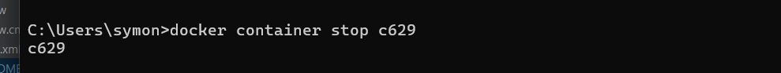

# Database Setup
We are using docker based approach for the db\
Step 1: Pull the docker image if you dont have the image locally
```dtd
docker pull mongo:latest
```
Step2: Run the following to start the container
```dtd
docker container run -p  27017: 27017   —name mongodb_webfluxtest -d mongo
```
You can have any name you like --name -p here is the port the first one is your local and the other one is the docker contiainer

Step 3: Verify the container running and Grab the id from there
```dtd
docker container ls or docker ps
```
Step 4: Run the bash inside the mongoshell. The 5370 is the container id from docker container ls
```dtd
docker exec -it 5370 bash
```
So now you are inside the container running bash

Run
```dtd
show dbs
```
to see all the database.

```dtd
use whatever_db_name
```
this creates a database for you 

## Database Configuration
Update this database configuration in application.properties in main/resources/application.properties
```dtd
spring.application.name=spring-webflux-test
spring.data.mongodb.uri=mongodb://127.0.0.1:27018/ems
```
I changed the port number since i have mongo installed locally and so that fiddles with the one in docker continer

Now what happens when you stop a container using
```dtd
docker container stop <container_number>;
```


You can restart it using 
```dtd
docker container restart <container-image_number>
```
You can get the previously stopped container image number using
```dtd
docker container ls -l
```
this should give you all the containers that are in your machine and are running also stopped as well

# Integration Tests
We will create every integration testFile under src/test/com.symon.spring.webflux - which our base package \

Since we are testing the EmployeeController layer we named our java class EmployeeControllerIntegrationTests
```dtd
@SpringBootTest(webEnvironment =SpringBootTest.WebEnvironment.RANDOM_PORT )
 
 - lets spring know that this is a test class
 - In the brackets we are specifying the webEnvironment
 - Here what we mean is that start springBootTest in any test environment
```

Now we will use webTestClient to make those rquest
```dtd
@SpringBootTest(webEnvironment =SpringBootTest.WebEnvironment.RANDOM_PORT )
public class EmployeeControllerIntegrationTests {
    @Autowired
    private EmployeeService employeeService;
    @Autowired
    private WebTestClient webTestClient;

- Here @Autowired is used to inject the implemenation during runtime that springboot 
does automatically
```
The first test here 
```dtd
  @Test
    public void testSaveEmployee(){
        EmployeeDto employeeDto = new EmployeeDto();

        employeeDto.setFirstName("Symon");

        employeeDto.setLastName("Test");

        employeeDto.setEmail("symon.asadul@gmail.com");

        EmployeeDto employeeDto1 = webTestClient.post().uri("/api/employee").contentType(MediaType.APPLICATION_JSON).accept().body(Mono.just(employeeDto),EmployeeDto.class).exchange().expectStatus().isCreated().expectBody(EmployeeDto.class).consumeWith(System.out::println).returnResult().getResponseBody();

    }
- You have to annotate using @Test without it spring won't know that this is a test

- post() is the type of request other options are get() put() delete

- uri("/api/employee") Specifies the URI for the POST request. In this case, it is /api/employee.

- contentType(MediaType.APPLICATION_JSON) Sets the Content-Type header to application/json, indicating that the request body will be in JSON format.

- accept(MediaType.APPLICATION_JSON) Sets the Accept header to application/json, indicating that the client expects a JSON response.

- body(Mono.just(employeeDto), EmployeeDto.class) Sets the body of the request. Mono.just(employeeDto) creates a Mono that emits the employeeDto object. The EmployeeDto.class specifies the type of the object in the request body.
 
- exchange() Executes the request and exchanges it with the server. This sends the request and waits for the response.

- .expectStatus().isCreated()  Asserts that the response status code is 201 Created. This is often the expected status code for a successful POST request that creates a new resource.

- .expectBody(EmployeeDto.class) Specifies that the body of the response should be deserialized into an instance of EmployeeDto. This method prepares the response body for further assertions.

- .consumeWith(System.out::println) Consumes the response body and prints it to the console using System.out::println. This is useful for debugging or logging the response.

- .returnResult() Returns the full result of the exchange, which includes the status, headers, and body.

- .getResponseBody()  Extracts the response body from the result. In this case, it will be an instance of EmployeeDto if the response contains a valid JSON object that can be deserialized into EmployeeDto.
```

Once you get the response body you can check with Assertions
```dtd
   Assertions.assertEquals(employeeDto.getEmail(),employeeDto1.getEmail());
        //Checks where Employeedid is empty or not.

        Assertions.assertTrue(employeeDto1.getId() != null);

        Assertions.assertNotNull(employeeDto1.getId(), "Employee ID should not be null");

        Assertions.assertFalse(employeeDto1.getId().isEmpty(), "Employee ID should not be empty");
        //YOu could also do this
```